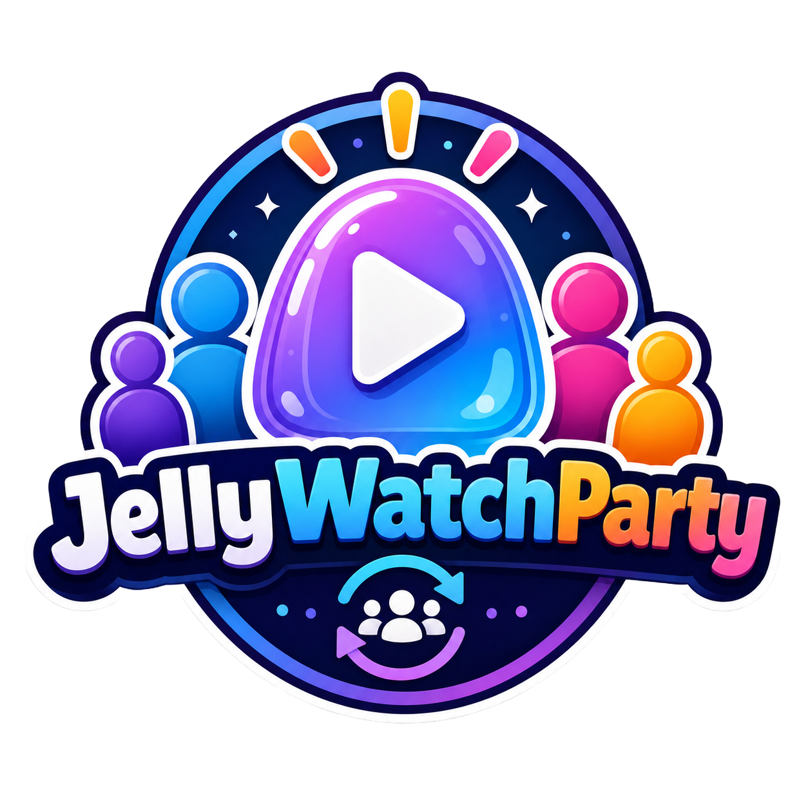

<p align="center">
  
</p>

<p align="center">
  <strong>Watch movies together, no matter the distance.</strong>
</p>

<p align="center">
  <a href="https://github.com/TIGamingTV/JellyWatchParty/actions/workflows/ci.yml"></a>
  
  
</p>

---

JellyWatchParty enables synchronized media playback for [Jellyfin](https://jellyfin.org/). It consists of a **Jellyfin Plugin** (C#) that integrates the UI and a **Session Server** (Rust) that manages rooms and synchronization via WebSocket.

Forked from https://github.com/mhbxyz/OpenWatchParty

> **Releases target Jellyfin 12.x only.** Jellyfin 10.11.x support has been
> dropped; if you're still on 10.11.x, install an older
> [release](https://github.com/TIGamingTV/JellyWatchParty/releases) (any
> version with a `targetAbi` of `10.11.11.0`) instead.

## Quick Start with the File transformation Plugin

### Users

**1. Start the session server** with Docker Compose. The chat bot
(Discord and/or Telegram) is optional; it only starts with the `discord` or
`telegram` profile.

```yaml
# docker-compose.yml
services:
  jwp-session:
    image: ghcr.io/tigamingtv/jwp-session-server:${JWP_TAG:-latest}
    container_name: jwp-session
    restart: unless-stopped
    ports:
      - "3000:3000"
      # Admin panel; only starts when ADMIN_PASSWORD is set.
      - "127.0.0.1:3001:3001"
      # Never publish 3002 (integration API for the chat bots).
    environment:
      - ALLOWED_ORIGINS=http://your-jellyfin:8096
      - JWT_SECRET=${JWT_SECRET:-}            # same value as in the plugin settings
      - ADMIN_PASSWORD=${ADMIN_PASSWORD:-}
      # Jellyfin devices (TV apps, Fladder, ...) in the admin panel and the bot
      - JELLYFIN_URL=${JELLYFIN_URL:-}        # as seen from this container
      - JELLYFIN_API_KEY=${JELLYFIN_API_KEY:-}
      # Chat bots: settings and link codes are kept in /data
      - DATA_DIR=/data
      - INTEGRATION_HOST=0.0.0.0
      - DISCORD_INTEGRATION_TOKEN=${DISCORD_INTEGRATION_TOKEN:-}
      - TELEGRAM_INTEGRATION_TOKEN=${TELEGRAM_INTEGRATION_TOKEN:-}
    volumes:
      - jwp-data:/data

  # Optional chat bots (Discord and/or Telegram, one container):
  # docker compose --profile discord up -d   (or --profile telegram)
  jwp-discord-bot:
    image: ghcr.io/tigamingtv/jwp-discord-bot:${JWP_TAG:-latest}
    container_name: jwp-discord-bot
    restart: unless-stopped
    profiles: [discord, telegram]
    depends_on: [jwp-session]
    environment:
      - JWP_INTEGRATION_URL=http://jwp-session:3002
      - DISCORD_BOT_TOKEN=${DISCORD_BOT_TOKEN:-}
      - DISCORD_INTEGRATION_TOKEN=${DISCORD_INTEGRATION_TOKEN:-}
      - TELEGRAM_BOT_TOKEN=${TELEGRAM_BOT_TOKEN:-}
      - TELEGRAM_INTEGRATION_TOKEN=${TELEGRAM_INTEGRATION_TOKEN:-}

volumes:
  jwp-data:
```

```bash
# .env next to docker-compose.yml
JWT_SECRET=<openssl rand -base64 32>
ADMIN_PASSWORD=<openssl rand -base64 18>
JELLYFIN_URL=http://your-jellyfin:8096
JELLYFIN_API_KEY=<Dashboard > API Keys>
# Only for the Discord bot:
DISCORD_INTEGRATION_TOKEN=<openssl rand -hex 32>
DISCORD_BOT_TOKEN=<Discord Developer Portal > Bot > Reset Token>
# Only for the Telegram bot (a different random value):
TELEGRAM_INTEGRATION_TOKEN=<openssl rand -hex 32>
TELEGRAM_BOT_TOKEN=<@BotFather > /newbot>
```

```bash
docker compose up -d                     # session server only
docker compose --profile discord up -d   # session server + chat bot(s)
```

The admin panel is at `http://localhost:3001/` on the server itself. The
compose file publishes it on `127.0.0.1` only; to reach it from another
machine, use an SSH tunnel, or publish it on `3001:3001` and put it behind
HTTPS (see the [Admin Panel guide](https://tigamingtv.github.io/JellyWatchParty/admin-panel/)).
To set up a bot, see the
[Discord Bot](https://tigamingtv.github.io/JellyWatchParty/discord-bot/) or
[Telegram Bot](https://tigamingtv.github.io/JellyWatchParty/telegram-bot/) guide.

**2. Add the plugin repository** in Jellyfin: **Dashboard > Plugins > Repositories > Add**

```
https://tigamingtv.github.io/JellyWatchParty/jellyfin-plugin-repo/manifest.json
```

Then go to the **Catalog** tab, install **JellyWatchParty**, and restart Jellyfin.

For Windows Server, manual installs, and enabling the client script: see the
**[Installation Guide](https://tigamingtv.github.io/JellyWatchParty/installation/)**.

### Testing develop builds

Every merge into `develop` publishes test builds. They aren't meant for
production.

| Component | Stable (release) | Develop |
|-----------|------------------|---------|
| Session server | `ghcr.io/tigamingtv/jwp-session-server:latest` | `ghcr.io/tigamingtv/jwp-session-server:dev` |
| Chat bot (Discord, Telegram) | `ghcr.io/tigamingtv/jwp-discord-bot:latest` | `ghcr.io/tigamingtv/jwp-discord-bot:dev` |
| Plugin repository | `.../jellyfin-plugin-repo/manifest.json` | `.../jellyfin-plugin-repo/manifest-dev.json` |

With the compose file above, set `JWP_TAG=dev` in `.env` (or `JWP_TAG=1.2.3`
to pin a release), then:

```bash
docker compose --profile discord pull
docker compose --profile discord up -d
```

For the plugin, add
`https://tigamingtv.github.io/JellyWatchParty/jellyfin-plugin-repo/manifest-dev.json`
as a repository and install **JellyWatchParty (Develop)**. Keep the server,
bot and plugin on the same channel.

### Developers

```bash
git clone https://github.com/TIGamingTV/JellyWatchParty.git
cd JellyWatchParty
just up
```

See the [Development Setup Guide](https://tigamingtv.github.io/JellyWatchParty/development/setup/) for the full workflow.

## Documentation

**[tigamingtv.github.io/JellyWatchParty](https://tigamingtv.github.io/JellyWatchParty/)** — start with
[Installation](https://tigamingtv.github.io/JellyWatchParty/installation/),
[Features](https://tigamingtv.github.io/JellyWatchParty/features/), and
[Core Structure](https://tigamingtv.github.io/JellyWatchParty/core-structure/).

## Contributing

- [Report bugs](https://github.com/TIGamingTV/JellyWatchParty/issues)
- [Submit pull requests](https://github.com/TIGamingTV/JellyWatchParty/pulls)
- [Contributing Guide](https://tigamingtv.github.io/JellyWatchParty/development/contributing/)

## License

MIT
